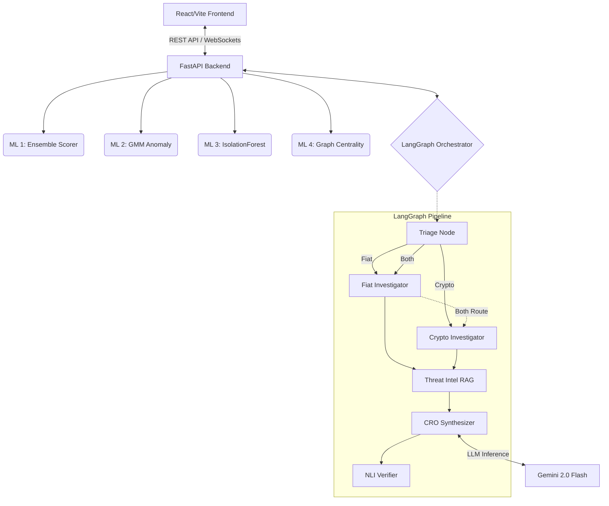
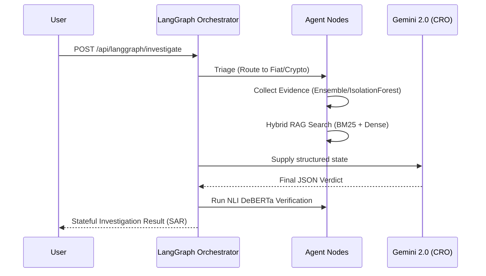

# 🛡️ Verifi Security Console (FraudGuardian)

Verifi is an enterprise-grade, **AI-driven fraud detection and surveillance platform**. It orchestrates a suite of advanced Machine Learning models—from ensemble classifiers to unsupervised anomaly detectors—to monitor transactions, analyze customer behavior, mitigate insider threats, and scrutinize decentralized finance (DeFi) interactions.

At the core of Verifi is a **Multi-Tool Agentic AI Investigation Engine** that autonomously queries the platform's ML modules to synthesize step-by-step reasoning chains and generate comprehensive risk reports.

---

## 🏗️ System Architecture

The platform is designed as a decoupled, high-performance architecture:

- **Frontend (React + Vite + TailwindCSS + Framer Motion):**
  A dark-themed, glassmorphism-styled security dashboard. It features live WebSocket feeds, dynamic ML model observatories, and animated reasoning chains for the AI Agent.
- **Backend (FastAPI):**
  A high-throughput API gateway that routes requests, maintains WebSocket connections for live DeFi radar feeds, and serves the ML inference engines.
- **Hierarchical LangGraph Orchestrator:**
  A stateful, multi-agent pipeline replacing the old single-agent design. It utilizes specialized nodes (Triage, Fiat Investigator, Crypto Investigator, RAG, and Synthesizer) coupled with NLI anti-hallucination guardrails to conduct complex fraud investigations.



---

## 🧠 Machine Learning Pipeline

Verifi employs a multi-layered, specialized ML architecture. Each risk domain is handled by a dedicated engine with its own preprocessing, modeling technique, and Explainable AI (XAI) methodology.

### 1. Transaction Fraud Detector (Ensemble Model)
* **Type:** Soft-Voting Classifier Ensemble (`RandomForest` + `GradientBoosting` + `LogisticRegression`)
* **Preprocessing:** SMOTE (Synthetic Minority Over-sampling Technique) for handling extreme class imbalance.
* **Explainability (XAI):** Uses **SHAP (SHapley Additive exPlanations)** to extract top contributing features for flagged transactions.

### 2. Customer Behavior & Employee Threat
* **Type:** Unsupervised `GaussianMixture` & `RandomForestRegressor`
* **Mechanics:** Analyzes internal telemetry (failed logins, overrides) and session data (velocity, device changes) to assign a continuous risk score and log-likelihood anomaly rating.

### 3. Crypto / DeFi Threat Assessment
* **Type:** Unsupervised `IsolationForest` (150 estimators, 5% contamination)
* **Mechanics:** Trains on synthetic Ethereum mainnet activity to flag outlier transactions operating on the fringe of the feature space (Gas usage, Gwei price, Tx Value).

### 4. Transaction Graph Analytics
* **Type:** NetworkX Graph Machine Learning
* **Mechanics:** Builds a directed graph of wallets, users, and exchanges. Computes **PageRank**, Eigenvector, and Betweenness Centrality (weighted by transaction volume) to identify potential money laundering hubs via 2-sigma anomaly detection.

### 5. 2-Stage Hybrid Threat Intel RAG
* **Type:** Parallel Sparse/Dense Retrieval + Cross-Encoder Reranking
* **Mechanics:** 
  1. **Retrieval**: Queries incoming risk profiles against historical attack vectors simultaneously using BM25 (sparse keyword) and `sentence-transformers` (dense cosine similarity).
  2. **Fusion**: Merges both retriever outputs using Reciprocal Rank Fusion (RRF).
  3. **Reranking**: Scores the fused list via a Cross-Encoder (`ms-marco-MiniLM-L-6-v2`) to surface the most relevant MITRE ATT&CK TTPs.

### 6. Anti-Hallucination NLI Verification
* **Type:** Natural Language Inference (Cross-Encoder)
* **Mechanics:** Before the final Suspicious Activity Report (SAR) is served, the system runs a DeBERTa NLI cross-encoder model to verify that the LLM's claims strictly **entail** the raw database evidence. If a contradiction is detected (score > 0.5), the report is flagged for hallucinations.

---

## 🤖 LangGraph Hierarchical Orchestrator

Verifi replaces manual SOC (Security Operations Center) workflows with a stateful, autonomous AI pipeline powered by **LangGraph**.

When a suspicious scenario is detected, the Orchestrator engages:
1. **Triage Node:** Analyzes initial ML signals (fiat & crypto) and routes the investigation down the appropriate arms.
2. **Parallel Investigators:** The `Fiat Investigator` and `Crypto Investigator` autonomously query internal ML engines and external APIs (Etherscan, Alchemy) to collect evidence.
3. **Threat Intel RAG Node:** Executes the 2-Stage Hybrid retrieval to match the ongoing attack against historical MITRE TTPs.
4. **CRO Synthesizer:** Powered by Gemini 2.0 Flash, it synthesizes the isolated ML outputs into a formal Suspicious Activity Report (SAR).
5. **NLI Verifier:** The final guardrail cross-checks the LLM's output against the raw evidence to prevent hallucinations.



*(Note: The system features robust graceful fallbacks. If LangGraph, LLM APIs, or heavy ML models fail to load, the system degrades to deterministic, rule-based execution and heuristic fallbacks to ensure zero downtime).*

---

## 📊 ML Model Observatory

A dedicated dashboard for ML Ops and Security Engineers to monitor model health in real-time.
- **Model Metadata:** View training sample counts, anomaly thresholds, and operational status.
- **Feature Importance:** Animated feature-importance bars display the live impact distribution of features across the models.
- **Graceful Fallbacks:** The dashboard visually indicates if a model is running "active" inference or using synthetic "fallback" generation due to missing artifacts.

---

## 🚀 Getting Started

### Prerequisites
- Python 3.9+
- Node.js 18+

### 1. Backend Setup
```bash
# Install Python dependencies
pip install -r requirements.txt

# Set Environment Variables (Optional but recommended)
export GOOGLE_API_KEY="your_gemini_key"
export ALCHEMY_URL="your_alchemy_https_url"
export ALCHEMY_WSS_URL="your_alchemy_wss_url"
export ETHERSCAN_API_KEY="your_etherscan_key"

# Run the FastAPI server
uvicorn api:app --host 0.0.0.0 --port 8000 --reload
```

### 2. Frontend Setup
```bash
cd Frontend
npm install

# Run the React/Vite development server
npm run dev
```
Navigate to `http://localhost:5173` to access the Verifi Security Console.

---
*Built for the future of enterprise security.* 🛡️