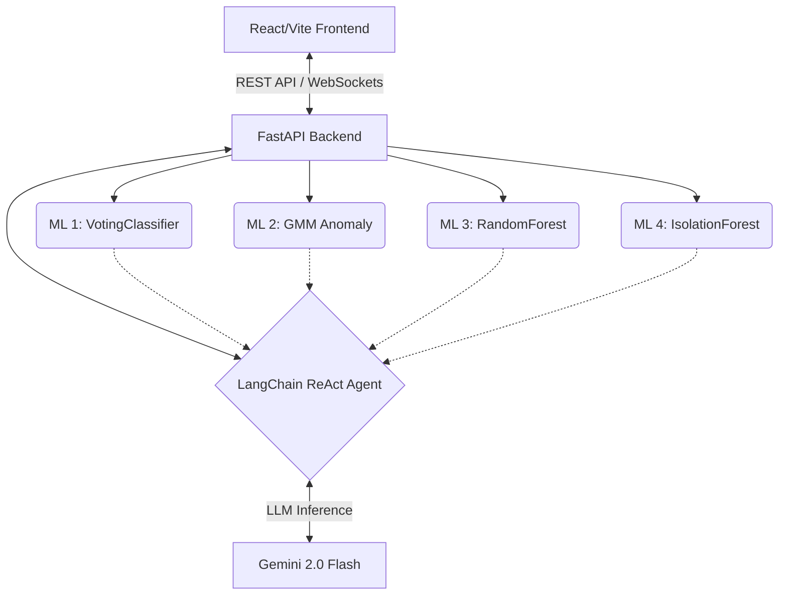
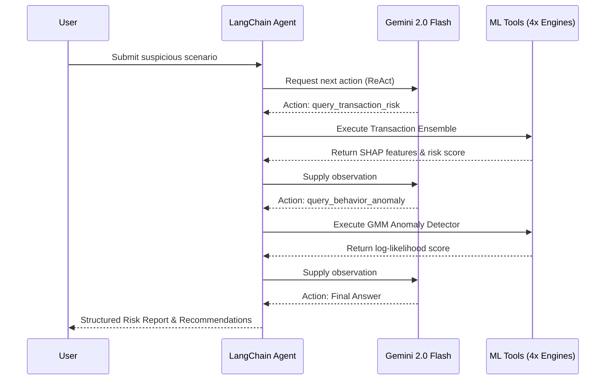

# 🛡️ Verifi Security Console (FraudGuardian)

Verifi is an enterprise-grade, **AI-driven fraud detection and surveillance platform**. It orchestrates a suite of advanced Machine Learning models—from ensemble classifiers to unsupervised anomaly detectors—to monitor transactions, analyze customer behavior, mitigate insider threats, and scrutinize decentralized finance (DeFi) interactions.

At the core of Verifi is a **Multi-Tool Agentic AI Investigation Engine** that autonomously queries the platform's ML modules to synthesize step-by-step reasoning chains and generate comprehensive risk reports.

---

## 🏗️ System Architecture

The platform is designed as a decoupled, high-performance architecture:

- **Frontend (React + Vite + TailwindCSS + Framer Motion):**
  A dark-themed, glassmorphism-styled security dashboard. It features live WebSocket feeds, dynamic ML model observatories, and animated reasoning chains for the AI Agent.
- **Backend (FastAPI):**
  A high-throughput API gateway that routes requests, maintains WebSocket connections for live DeFi radar feeds, and serves the ML inference engines.
- **Agentic AI Core (LangChain + Gemini 2.0 Flash):**
  A ReAct-style autonomous agent that accesses the ML models as tools to conduct complex fraud investigations.



---

## 🧠 Machine Learning Pipeline

Verifi employs a multi-layered, specialized ML architecture. Each risk domain is handled by a dedicated engine with its own preprocessing, modeling technique, and Explainable AI (XAI) methodology.

### 1. Transaction Fraud Detector (Ensemble Model)
* **Type:** Soft-Voting Classifier Ensemble (`RandomForest` + `GradientBoosting` + `LogisticRegression`)
* **Preprocessing:** SMOTE (Synthetic Minority Over-sampling Technique) for handling extreme class imbalance.
* **Features:** Amount, Haversine distance, temporal features (hour/day), frequency-encoded categorical variables.
* **Explainability (XAI):** Uses **SHAP (SHapley Additive exPlanations) TreeExplainer** to extract the top contributing features for every flagged transaction, explaining *why* the model made its decision (e.g., `amt (impact: +0.342)`).

### 2. Customer Behavior Anomaly Engine
* **Type:** Unsupervised `GaussianMixture` (2-Component GMM with full covariance)
* **Features:** Click velocity, session length, device change rates, location variance, and browser jump frequencies.
* **Mechanics:** The model is trained on standard user distributions. It evaluates new sessions by computing the log-likelihood of the session's feature vector. Sessions falling below the 5th-percentile threshold are classified as anomalous.
* **Risk Tiers:** NORMAL → SUSPICIOUS → ANOMALOUS

### 3. Employee Insider Threat Scorer
* **Type:** `RandomForestRegressor`
* **Features:** Failed logins, manual overrides, after-hours access, work duration, and role-based policies.
* **Mechanics:** Analyzes internal telemetry to predict a continuous risk score.
* **Explainability:** Factor-based attribution identifies top risk indicators (e.g., "Frequent manual overrides").

### 4. Crypto / DeFi Threat Assessment
* **Type:** Unsupervised `IsolationForest` (150 estimators, 5% contamination)
* **Features:** Transaction Value (ETH), Gas Used, Gas Price (Gwei).
* **Mechanics:** Trains on a synthetic distribution mapping normal Ethereum mainnet activity. It flags outliers operating on the fringe of the feature space, injecting high risk scores directly into the heuristic crypto analysis engine.

---

## 🤖 Multi-Tool Agentic Investigation Engine

Verifi replaces manual SOC (Security Operations Center) workflows with an autonomous AI investigator. 

When a suspicious scenario is detected, the **LangChain ReAct Agent** engages:
1. **Tool Execution:** The agent autonomously queries the Transaction Scorer, Behavior GMM, Employee Scorer, and Crypto Engine.
2. **Reasoning Chain:** It constructs a step-by-step evidence trail (visible in the UI).
3. **Synthesis:** Powered by Gemini 2.0 Flash, it synthesizes the isolated ML outputs into a coherent human-readable report.
4. **Action:** It assigns a final risk tier (CRITICAL, HIGH, MEDIUM, LOW) and suggests actionable recommendations (e.g., "Freeze Account", "Require Step-Up Auth").



*(Note: The system falls back gracefully to a robust rule-based engine if LLM API keys are unavailable, ensuring zero downtime).*

---

## 📊 ML Model Observatory

A dedicated dashboard for ML Ops and Security Engineers to monitor model health in real-time.
- **Model Metadata:** View training sample counts, anomaly thresholds, and operational status.
- **Feature Importance:** Animated feature-importance bars display the live impact distribution of features across the models.
- **Graceful Fallbacks:** The dashboard visually indicates if a model is running "active" inference or using synthetic "fallback" generation due to missing artifacts.

---

## 🚀 Getting Started

### Prerequisites
- Python 3.9+
- Node.js 18+

### 1. Backend Setup
```bash
# Install Python dependencies
pip install -r requirements.txt

# Set Environment Variables (Optional but recommended)
export GOOGLE_API_KEY="your_gemini_key"
export ALCHEMY_URL="your_alchemy_https_url"
export ALCHEMY_WSS_URL="your_alchemy_wss_url"
export ETHERSCAN_API_KEY="your_etherscan_key"

# Run the FastAPI server
uvicorn api:app --host 0.0.0.0 --port 8000 --reload
```

### 2. Frontend Setup
```bash
cd Frontend
npm install

# Run the React/Vite development server
npm run dev
```
Navigate to `http://localhost:5173` to access the Verifi Security Console.

---
*Built for the future of enterprise security.* 🛡️